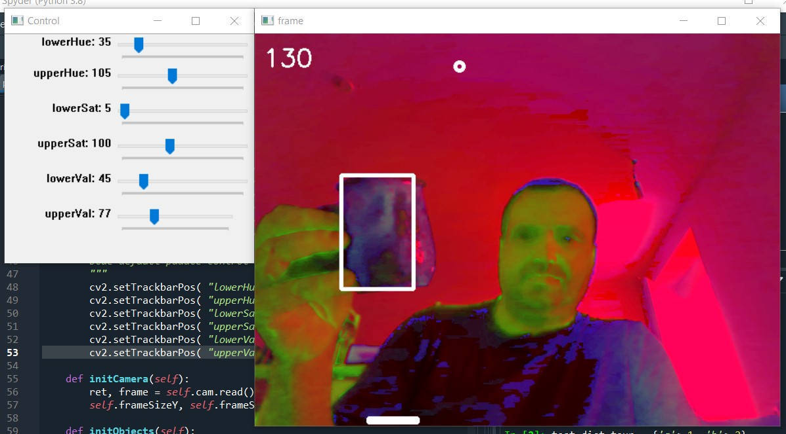
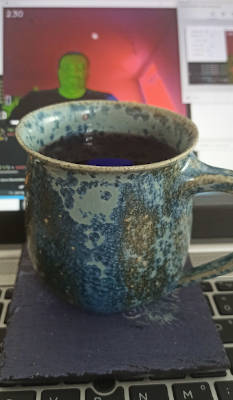

# PongOCV
PongOCV is a solo Pong or Breakout alike game using Computer Vision via
live camera video (e.g. camera from your notebook) to control your paddle.

## Third Party Libraries
Third Party Dependencies:

* Computer Vision Library OpenCV, https://opencv.org/

## Legal and Licensing
Copyright (c) 2021, Oliver Merkel.
Please see the AUTHORS file for details.
All rights reserved.

Use of this code is governed by a
MIT license that can be found in the LICENSE file.

## Changes
Version tagged _01-bouncing_ball_and_webcam_image_:
* https://github.com/OMerkel/PongOCV/releases/tag/01-bouncing_ball_and_webcam_image

Version tagged _02-full_PongOCV_game_:
* https://github.com/OMerkel/PongOCV/releases/tag/02-full_PongOCV_game

The video is shown in wrong colors. This is since the RGB is converted into HSV space.
Conversion is done to ease description of the color detected object.
Uni colored objects have uniform or nar
rower range in hue and dependent on light the saturation and brightness can cover a wider range.
Now if converted HSV space is drawn on RGB canvas these wrong colors show up.

* Adding a control panel to configure the lower and upper ranges of HSV (Hue, Sat, Val) to describe the controlling object
* Draw boundary box on biggest detected object of the HSV in range
* Mirror the camera image
* Convert from RBG to HSV to ease description of the color detected object
* Adding a paddle controlled by the controlling object
* Score 10 points each time you bounce the ball with your paddle
* Default HSV range is some blueish object. Feel free to configure your HSV ranges...

Above image should show you what kind of object shall be detected in my scenario. Feel free to configure your own...

Version tagged _03-RGB_and_HSV_:
* https://github.com/OMerkel/PongOCV/releases/tag/03-RGB_and_HSV

* stricter handling RGB for drawing and HSV for analysis
* Avoid devision by zero if width of detected colored object covers complete screen width
* Use left paddle edge in computations instead of paddle center
* Minor corrections due to usage of integer arithmetics

## External Links

### HSV Basics

* https://en.wikipedia.org/wiki/HSL_and_HSV
    * _Hint:_ Hold a color spectrum (full range of rainbow colors) in front of the camera. Then play around with the hue value settings of the control panel.
 
